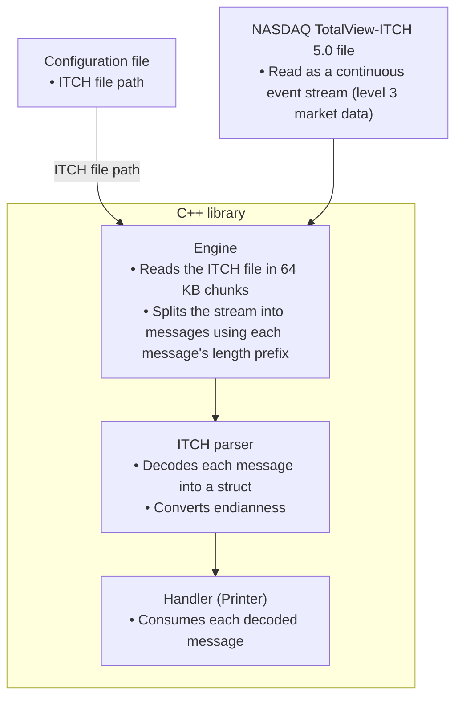

# ITCH 5.0 Parser

A C++20 library that reads NASDAQ TotalView-ITCH 5.0 binary files, splits the stream into individual messages, decodes each into a struct, and dispatches it to a handler.

## Parser

- Reads a binary ITCH 5.0 file in fixed-size chunks. A chunk rarely ends exactly on a message boundary, so the leftover bytes of the last, incomplete message are kept and joined with the start of the next chunk before parsing.
- Handles endianness: ITCH files store numbers most-significant-byte-first, so each field's bytes are reversed to match how the host machine reads them.
- Decodes each message by treating the raw bytes as a struct instead of decoding them field by field.
- Dispatches each decoded message to a handler. The included `Printer` handler prints every message; the parser is generic over the handler, so other consumers can be plugged in.

### Supported ITCH 5.0 messages

#### Stock related messages

| Type | Message | Description |
|------|---------|-------------|
| `S` | `SystemEvent` | Used to signal a market or data feed handler event. |
| `R` | `StockDirectory` | Sent at the start of each trading day for all active symbols. |
| `H` | `StockTradingAction` | Indicate the current trading status of a security: halted (H), paused (P), quote-only (Q), or trading (T). |

#### Order related messages

| Type | Message | Description |
|------|---------|-------------|
| `A` | `AddOrder` | A new order has been accepted and was added to the order book (no MPID attribution). |
| `F` | `AddOrderMPID` | A new order has been accepted and was added to the order book (MPID attribution). |
| `E` | `OrderExecuted` | An order on the book was executed in whole or in part at its display price. |
| `C` | `OrderExecutedWithPrice` | An order on the book was executed in whole or in part at a price different from the initial display price. |
| `X` | `OrderCancel` | An order on the book was partially canceled, which reduces shares on an existing order. |
| `D` | `OrderDelete` | An order on the book was cancelled entirely and must be removed from the book. |
| `U` | `OrderReplace` | An order on the book was cancelled and replaced with a new order. |

### Configuration

A JSON config points the engine at the ITCH file to read (`nasdaq_historical_file_path`). See `examples/simple-example.json`.

## Pipeline



## Roadmap

Planned: order book reconstruction, Python bindings, and a Python layer for analysis.

## Stack

- Build system: [CMake](https://cmake.org/), a cross-platform build system generator.
- Package manager: [Conan](https://conan.io/), a C/C++ dependency manager widely used in production environments.

## Getting started

### Requirements

- [CMake](https://cmake.org/): if not installed, refer to the [installation guide](https://cmake.org/download/).
- [Conan](https://conan.io/): if not installed, refer to the [installation guide](https://docs.conan.io/2/installation.html).

Run the following command once:
```sh
conan profile detect --force
```

### Dataset

Small sample files are provided in the `examples/` folder and are what the engine runs on.

Full historical days (e.g. `01302020.NASDAQ_ITCH50.gz`) can be downloaded from `https://emi.nasdaq.com/ITCH/Nasdaq%20ITCH/`, but a decompressed day is very large.

The data format is defined by the document [Nasdaq TotalView-ITCH 5.0](https://www.nasdaqtrader.com/content/technicalsupport/specifications/dataproducts/NQTVITCHspecification.pdf).

### Installation

1. Clone the git repository.
```sh
git clone git@github.com:sephorah/itch-5.0-parser.git
cd itch-5.0-parser
```

2. Install dependencies.
```sh
./bin/setup.sh install
```

3. Build the project.
```sh
./bin/setup.sh build
```

### Run tests 

```sh
./bin/setup.sh tests
```

You can also run the parser directly with a config file:
```sh
./build/Release/bin/RunEngine examples/simple-example.json
```
