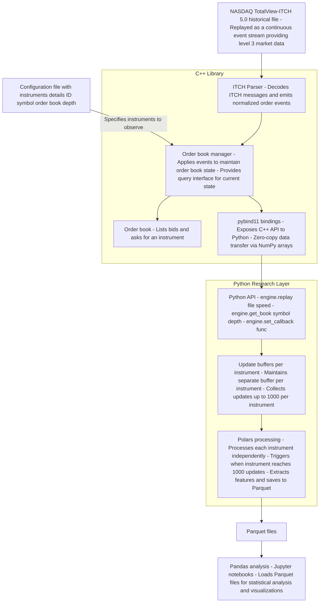

```mermaid
flowchart TD

    config_file[Configuration file with instruments details ID symbol order book depth]
    
    nasdaq_itch_file[NASDAQ TotalView-ITCH 5.0 historical file - Replayed as a continuous event stream providing level 3 market data]

    subgraph cpp_library[C++ Library]

        feed_handler[ITCH Parser - Decodes ITCH messages and emits normalized order events]

        order_book_manager[Order book manager - Applies events to maintain order book state - Provides query interface for current state]
        
        order_book[Order book - Lists bids and asks for an instrument]

        pybind11_interface[pybind11 bindings - Exposes C++ API to Python - Zero-copy data transfer via NumPy arrays]
    end

    subgraph python_layer[Python Research Layer]
        
        api_usage[Python API - engine.replay file speed - engine.get_book symbol depth - engine.set_callback func]

        update_buffers[Update buffers per instrument - Maintains separate buffer per instrument - Collects updates up to 1000 per instrument]

        polars_processing[Polars processing - Processes each instrument independently - Triggers when instrument reaches 1000 updates - Extracts features and saves to Parquet]
    end

    parquet_files[Parquet files]
    
    pandas_analysis[Pandas analysis - Jupyter notebooks - Loads Parquet files for statistical analysis and visualizations]


    config_file -->|Specifies instruments to observe| order_book_manager
    order_book_manager --> order_book
    nasdaq_itch_file --> feed_handler
    feed_handler --> order_book_manager
    order_book_manager --> pybind11_interface
    pybind11_interface --> api_usage
    api_usage --> update_buffers
    update_buffers --> polars_processing
    polars_processing --> parquet_files
    parquet_files --> pandas_analysis
```
